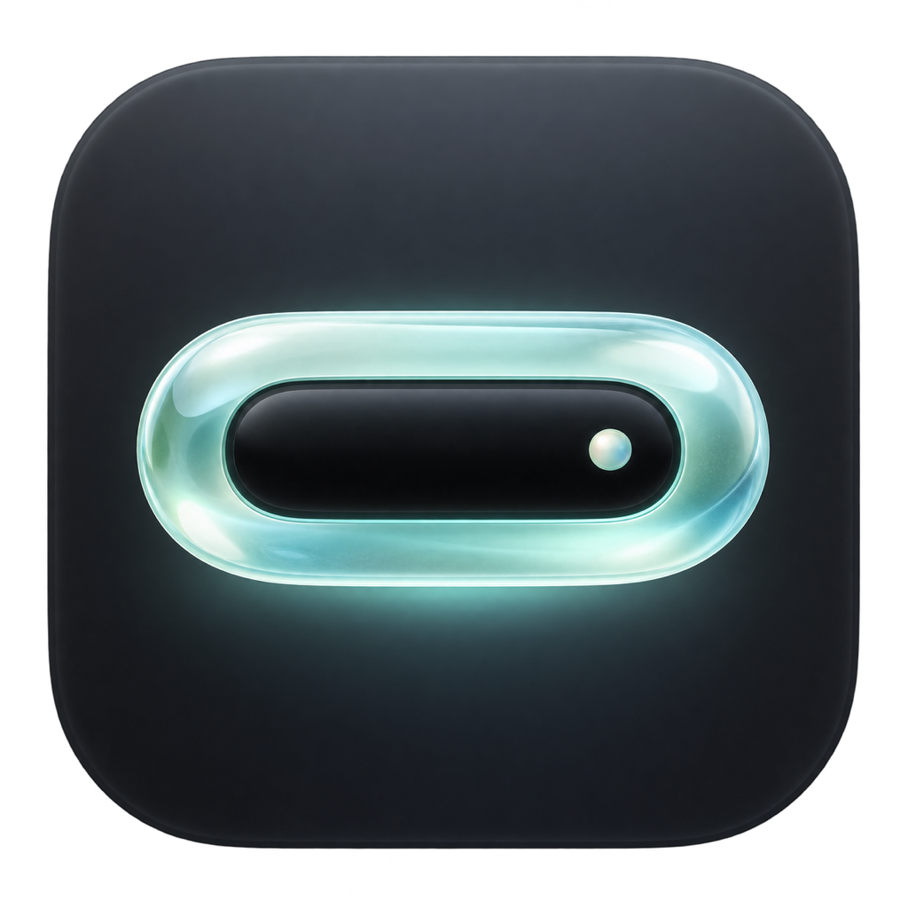

# Lumora

<p align="center">
  
</p>

<p align="center">
  <strong>A live MacBook notch surface for agents, music, and system status.</strong>
</p>

<p align="center">
  <a href="./readme/README.zh-CN.md">简体中文</a>
</p>

Lumora turns the MacBook notch into a compact desktop control layer. The home view keeps high-signal context in one place: Mac performance, now playing controls, and live AI coding sessions.

Lumora (灵屿) is a locally developed macOS notch app with Chinese localization, interaction refinements, and menu bar overlap handling.

## What It Does

| Area | Features |
| --- | --- |
| Agent sessions | Monitor Claude Code, Codex, OpenCode, and Cursor from local hook events. |
| Session detail | Show prompts, thinking, tool calls, tool results, approvals, user questions, completion state, and token usage. |
| Music | Display artwork, source app, track metadata, progress, play/pause, previous/next, and open-source-app controls. |
| System status | Surface CPU, memory, battery, and network status with configurable performance detail pages. |
| Settings | Configure screen selection, notification sound, agent hooks, shortcuts, glow effects, launch at login, and accessibility. |
| Appearance | Switch between Music dynamic color, macOS 26+ Glass, and pure Black notch styles. |

## Agent Support

Lumora normalizes local agent events into a shared session timeline.

- Claude Code: hooks, transcript parsing, status tracking, interrupt detection, permission handling, and tmux-aware terminal focus.
- Codex: hooks, transcript parsing, terminal approval state, compacting and subagent events, and stable completed-session history.
- OpenCode: event-stream integration with live tool placeholders, user-input state, subagent tracking, and idle/completion transitions.
- Cursor: session lifecycle, processing/compacting state, thought and response updates, tool calls, and session cleanup.

## Appearance

The settings page exposes three notch styles:

- `Music`: uses artwork-derived colors for the expanded notch when music is playing.
- `Glass`: uses Liquid Glass on macOS 26+ and only appears when supported.
- `Black`: keeps the expanded notch clean and solid black.

The collapsed notch stays visually quiet; the glass treatment is limited to the expanded panel.

## Install

Build `Lumora.app` from this source tree. A public download has not been configured yet.

1. Build the app using the instructions below.
2. Place `Lumora.app` in `Applications`.
3. Open `Lumora` from `Applications`.

If macOS blocks the first launch, open `System Settings` -> `Privacy & Security`, allow Lumora to run, then open it again.

## Requirements

- macOS 15.6 or later.
- macOS 26 or later for the Glass appearance option.
- macOS 27 or later for automatic menu bar icon avoidance.
- Claude Code, Codex, OpenCode, or Cursor installed for the matching agent integration.
- Accessibility permission is needed for menu bar overlap detection, global shortcuts, and focus behavior.

## Build From Source

```bash
xcodebuild -project Lumora.xcodeproj -scheme Lumora -configuration Debug build
```

```bash
xcodebuild test -project Lumora.xcodeproj -scheme Lumora -configuration Debug -derivedDataPath build/TestDerivedData -destination 'platform=macOS'
```

See [docs/testing.md](./docs/testing.md) for testing notes. Lumora release notes are maintained in [LUMORA_RELEASE_NOTES.md](./LUMORA_RELEASE_NOTES.md).

## Project Map

- `Lumora/Core`: settings, geometry, shortcuts, activity coordination, and view model state.
- `Lumora/Services/Hooks`: hook installers and Unix socket ingress for agent events.
- `Lumora/Services/Session`: transcript parsing, status watching, and session monitoring.
- `Lumora/Services/State`: central session store and tool-event processing.
- `Lumora/Services/Music`: now playing integration, media controls, and artwork color extraction.
- `Lumora/Services/System`: performance sampling.
- `Lumora/UI`: notch shell, session list, chat detail, music, performance, and settings views.

## Acknowledgements

Lumora is distributed under GPL-3.0. See [LICENSE](./LICENSE) and [THIRD_PARTY_NOTICES.md](./THIRD_PARTY_NOTICES.md) for applicable license and third-party notices.
